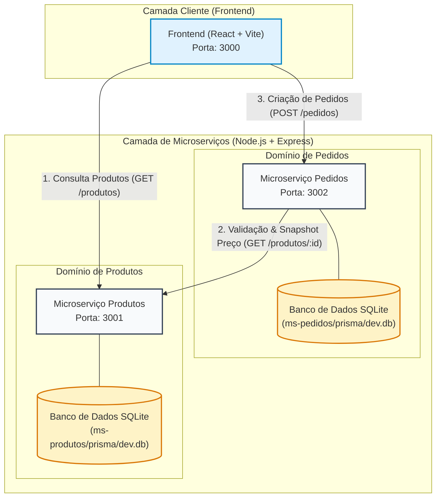

# Sistema Distribuído de Catálogo e Pedidos — Arquitetura de Microserviços

**Instituição:** Instituto Federal de Educação, Ciência e Tecnologia de São Paulo (IFSP)  
**Curso / Disciplina:** Tecnologia em Análise e Desenvolvimento de Sistemas | DSW 3 (Desenvolvimento Web 3)  
**Docente Responsável:** Prof. Me. André Luís Bordignon  
**Aluno:** Enzo Alves dos Santos Souza  
**Matrícula:** CP3025802  
**Etapa:** Momento 1 — Modelagem da Arquitetura e Estrutura Inicial das APIs  

---

## 1. Visão Geral do Sistema

Aplicação web distribuída baseada no padrão arquitetural de **Microserviços** para gestão de catálogo e processamento de pedidos de compra através de serviços backend autônomos, desacoplados e conteinerizáveis.

### Padrões Arquiteturais Implementados
- **Database-per-Service:** Cada microserviço possui sua própria base de dados relacional física e logicamente isolada (`dev.db` via SQLite), garantindo autonomia e impedindo acoplamento em nível de banco de dados.
- **Snapshot Pattern:** Na criação do pedido via `POST /pedidos`, o `ms-pedidos` consulta o `ms-produtos` de forma síncrona para validar estoque e capturar uma cópia imutável do nome e preço unitário do item no ato da compra.
- **Comunicação Síncrona Service-to-Service:** O `ms-pedidos` utiliza cliente HTTP Axios para consultar `GET /produtos/:id` antes de consolidar qualquer transação.
- **Tratamento de Falhas e Degradação Graciosa:** Retorno de códigos HTTP padronizados (`201 Created`, `400 Bad Request`, `404 Not Found` e `503 Service Unavailable` em caso de indisponibilidade de rede).

---

## 2. Diagrama Arquitetural e Topologia de Serviços



---

## 3. Matriz de Componentes e Tecnologias

| Componente | Tecnologia Base | Porta | Responsabilidade Principal |
| :--- | :--- | :---: | :--- |
| **Frontend SPA** | React (Vite), Axios, Tailwind CSS | `3000` | Interface gráfica, catálogo de produtos, criação e histórico de pedidos, tratamento amigável de falhas. |
| **ms-produtos** | Node.js, Express, Prisma ORM, SQLite | `3001` | Gestão do catálogo de itens, controle de precificação atual e quantidades em estoque. |
| **ms-pedidos** | Node.js, Express, Axios, Prisma ORM, SQLite | `3002` | Processamento de vendas, validação remota síncrona de estoque, snapshot de valores e histórico. |

---

## 4. Especificação dos Contratos de API (Endpoints)

### 4.1. Microserviço de Produtos (`http://localhost:3001`)

| Método | Endpoint | Descrição | Códigos HTTP |
| :--- | :--- | :--- | :--- |
| `POST` | `/produtos` | Cadastrar novo produto no catálogo | `201 Created`, `400 Bad Request` |
| `GET` | `/produtos` | Listar todos os produtos ativos | `200 OK` |
| `GET` | `/produtos/:id` | Buscar detalhes de um produto específico | `200 OK`, `404 Not Found` |
| `PATCH` | `/produtos/:id/estoque` | Atualização de estoque (baixa de venda) | `200 OK`, `400 Bad Request`, `404 Not Found` |
| `GET` | `/health` | Health Check do serviço | `200 OK` |

#### Payload de Exemplo (Cadastro):
```json
{
  "nome": "Monitor Gamer 27 165Hz",
  "preco": 1250.00,
  "descricao": "Monitor IPS 1ms FreeSync",
  "estoque": 15
}
```

---

### 4.2. Microserviço de Pedidos (`http://localhost:3002`)

| Método | Endpoint | Descrição | Códigos HTTP |
| :--- | :--- | :--- | :--- |
| `POST` | `/pedidos` | Criar pedido com validação e Snapshot Pattern | `201 Created`, `400`, `404`, `503` |
| `GET` | `/pedidos` | Listar histórico de pedidos | `200 OK` |
| `GET` | `/pedidos/:id` | Detalhes de um pedido com snapshot | `200 OK`, `404 Not Found` |
| `GET` | `/health` | Health Check do serviço | `200 OK` |

#### Payload de Exemplo (Criação de Pedido):
```json
{
  "produtoId": "a1b2c3d4-e5f6-7890-abcd-ef1234567890",
  "quantidade": 2
}
```

#### Respostas de Erro Mapeadas:
- **`400 Bad Request`**: `{"error": "Quantidade solicitada excede o estoque disponível (Disponível: X)."}`
- **`404 Not Found`**: `{"error": "Produto informado não existe no catálogo."}`
- **`503 Service Unavailable`**: `{"error": "Serviço de Produtos temporariamente indisponível para validação."}`

---

## 5. Coleção de Testes do Postman

O repositório disponibiliza na raiz o arquivo **[`dsw3-postman-collection.json`](./dsw3-postman-collection.json)** pronto para importação no Postman ou Insomnia.
A coleção inclui:
- Requisições estruturadas para o `ms-produtos` e `ms-pedidos`.
- Payloads com dados do documento da disciplina.
- Cenários de sucesso (`201`) e cenários de erro simulados (`400`, `404`, `503`).

---

## 6. Instruções de Execução Local (Passo a Passo)

### Pré-requisitos
- Node.js versão 18+ instalada.
- NPM versão 9+ instalada.

### Passo 1: Instalação das Dependências
Na raiz do projeto, execute a instalação nas respectivas pastas:
```bash
# Microserviço de Produtos
cd ms-produtos
npm install

# Microserviço de Pedidos
cd ../ms-pedidos
npm install

# Frontend
cd ../frontend
npm install
```

### Passo 2: Inicialização dos Bancos de Dados SQLite (Prisma)
Gere o Prisma Client e sincronize as tabelas locais:
```bash
# Em ms-produtos:
cd ms-produtos
npx prisma generate
npx prisma db push

# Em ms-pedidos:
cd ../ms-pedidos
npx prisma generate
npx prisma db push
```

### Passo 3: Inicialização dos Servidores
Abra dois terminais separados (ou execute em background):

**Terminal 1 — Microserviço de Produtos:**
```bash
cd ms-produtos
npm run dev
# Servidor rodará em http://localhost:3001
```

**Terminal 2 — Microserviço de Pedidos:**
```bash
cd ms-pedidos
npm run dev
# Servidor rodará em http://localhost:3002
```

**Terminal 3 — Frontend (Opcional na Entrega 1):**
```bash
cd frontend
npm run dev
# Interface rodará em http://localhost:3000
```
