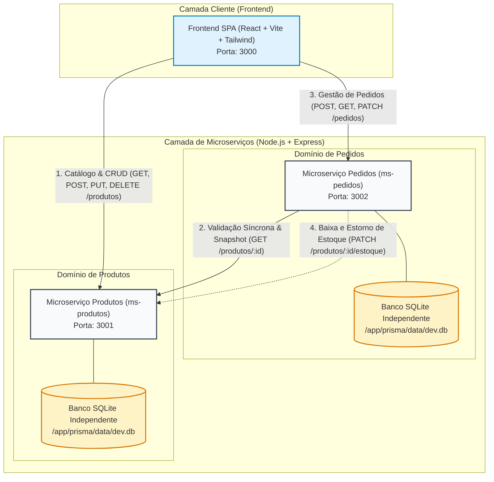

# Sistema Distribuído de Catálogo e Pedidos — Arquitetura de Microserviços

**Instituição:** Instituto Federal de Educação, Ciência e Tecnologia de São Paulo (IFSP)  
**Curso / Disciplina:** Tecnologia em Análise e Desenvolvimento de Sistemas | DSW 3 (Desenvolvimento Web 3)  
**Docente Responsável:** Prof. Me. André Luís Bordignon  
**Aluno:** Enzo Alves dos Santos Souza  
**Matrícula:** CP3025802  
**Status do Projeto:** 100% Implementado (Momentos 1, 2, 3 e 4)

---

## 1. Visão Geral do Sistema

Aplicação web distribuída de ponta a ponta desenvolvida sob o padrão arquitetural de **Microserviços**, composta por dois serviços de backend independentes (`ms-produtos` e `ms-pedidos`) e uma aplicação cliente única desenvolvida em **React (Vite)** com foco em alta resiliência, degradação graciosa e tolerância a falhas.

### Padrões Arquiteturais Implementados
- **Database-per-Service:** Cada microsserviço gerencia exclusivamente sua própria base de dados relacional (SQLite via Prisma ORM). O isolamento é total: nenhum microsserviço realiza consultas diretas ao banco do outro.
- **Snapshot Pattern:** No momento da realização de um pedido (`POST /pedidos`), o `ms-pedidos` consulta síncronamente o `ms-produtos` e grava uma **cópia imutável** do `nomeProduto` e do `precoUnitario` no banco de pedidos. Isso impede que atualizações cadastrais ou alterações de preços futuras distorçam o histórico contábil/financeiro das compras já efetuadas.
- **Comunicação Síncrona Service-to-Service:** O `ms-pedidos` utiliza cliente HTTP Axios para consultar `GET /produtos/:id` antes de consolidar qualquer pedido, validando simultaneamente existência e saldo de estoque.
- **Compensação e Ciclo de Vida (Estorno de Estoque):** No cancelamento do pedido (`PATCH /pedidos/:id/cancelar`), o `ms-pedidos` comunica-se com o `ms-produtos` para estornar a quantidade ao estoque em tempo real.
- **Resiliência e Degradação Graciosa:** Códigos de resposta HTTP padronizados (`201`, `400`, `404` e `503 Service Unavailable` em falhas remotas). No frontend, caso um dos microsserviços caia ou fique offline, o sistema não gera tela branca, exibindo avisos amigáveis e mantendo as demais funcionalidades ativas.
- **Persistência Segura de Contêineres:** Bancos SQLite alocados na subpasta isolada `/app/prisma/data/dev.db` com volumes Docker nomeados independentes, evitando a sobreposição de arquivos durante o `npx prisma generate` e inicialização.

---

## 2. Diagrama Arquitetural e Topologia de Serviços



---

## 3. Matriz de Componentes e Tecnologias

| Componente | Diretório | Tecnologias Principais | Porta | Persistência / Volume |
| :--- | :--- | :--- | :---: | :--- |
| **ms-produtos** | `/ms-produtos` | Node.js 20, Express, Prisma ORM, SQLite | `3001` | Volume Docker `produtos-data` (`/app/prisma/data`) |
| **ms-pedidos** | `/ms-pedidos` | Node.js 20, Express, Axios, Prisma ORM, SQLite | `3002` | Volume Docker `pedidos-data` (`/app/prisma/data`) |
| **Frontend** | `/frontend` | React 18, Vite, Axios, Tailwind CSS, Lucide, Nginx | `3000` | N/A (Build SPA estático multi-stage) |
| **Orquestrador** | `/` | Docker Compose (v3.8) | — | Rede interna `dsw3-network` (bridge) |

---

## 4. Especificação dos Contratos de API (Endpoints)

### 4.1. Microserviço de Produtos (`http://localhost:3001`)

| Método | Endpoint | Descrição / Regra | Códigos HTTP |
| :--- | :--- | :--- | :--- |
| `GET` | `/health` | Health check da saúde do serviço | `200 OK` |
| `GET` | `/produtos` | Listar todos os produtos do catálogo (ordenados por nome) | `200 OK` |
| `GET` | `/produtos/:id` | Buscar detalhes de um produto por UUID | `200 OK`, `404 Not Found` |
| `POST` | `/produtos` | Cadastrar novo produto no catálogo (CRUD) | `201 Created`, `400 Bad Request` |
| `PUT` | `/produtos/:id` | Atualizar dados completos do produto (CRUD) | `200 OK`, `400`, `404` |
| `DELETE`| `/produtos/:id` | Excluir produto do catálogo (CRUD) | `200 OK`, `404 Not Found` |
| `PATCH`| `/produtos/:id/estoque` | Atualizar saldo de estoque (`subtrair` ou `adicionar`) | `200 OK`, `400`, `404` |

#### Payload de Exemplo (Cadastro / Edição de Produto):
```json
{
  "nome": "Monitor Gamer 27 165Hz",
  "preco": 1250.00,
  "descricao": "Monitor IPS 1ms FreeSync HDR",
  "estoque": 15
}
```

---

### 4.2. Microserviço de Pedidos (`http://localhost:3002`)

| Método | Endpoint | Descrição / Regra | Códigos HTTP |
| :--- | :--- | :--- | :--- |
| `GET` | `/health` | Health check da saúde do serviço | `200 OK` |
| `GET` | `/pedidos` | Listar histórico de pedidos (mais recentes primeiro) | `200 OK` |
| `GET` | `/pedidos/:id` | Obter detalhes e snapshot de um pedido por UUID | `200 OK`, `404 Not Found` |
| `POST` | `/pedidos` | Criar pedido com validação síncrona e Snapshot Pattern | `201 Created`, `400`, `404`, `503` |
| `PATCH`| `/pedidos/:id/cancelar` | Cancelar pedido e estornar estoque no catálogo | `200 OK`, `400`, `404` |

#### Payload de Exemplo (Criação de Pedido):
```json
{
  "produtoId": "4905338d-8204-45c1-b908-90c7fd305d55",
  "quantidade": 2
}
```

#### Tratamento de Respostas e Falhas Mapeadas:
- **`201 Created`**: Pedido aprovado com sucesso, contendo o snapshot imutável do nome e preço unitário.
- **`400 Bad Request`**: Quantidade requerida excede o estoque disponível no catálogo.
- **`404 Not Found`**: Produto informado não existe no catálogo.
- **`503 Service Unavailable`**: `ms-produtos` está offline/inacessível no momento da validação síncrona.

---

## 5. Como Executar o Projeto

### Opção 1: Via Docker Compose (Recomendado — Um Único Comando)

Com o Docker e Docker Compose instalados na máquina:

```bash
# Na raiz do projeto, construa as imagens e inicialize todos os contêineres:
docker compose up --build
```

Os 3 serviços estarão imediatamente acessíveis:
- **Frontend SPA:** [http://localhost:3000](http://localhost:3000)
- **API de Produtos:** [http://localhost:3001](http://localhost:3001) (Health: `/health`)
- **API de Pedidos:** [http://localhost:3002](http://localhost:3002) (Health: `/health`)

Para parar os serviços mantendo a persistência dos dados:
```bash
docker compose down
```

---

### Opção 2: Execução Local Tradicional (Node.js)

#### 1. Instalar Dependências
```bash
cd ms-produtos && npm install && cp .env.example .env
cd ../ms-pedidos && npm install && cp .env.example .env
cd ../frontend && npm install
```

#### 2. Sincronizar Bancos de Dados SQLite (Prisma)
```bash
# Em ms-produtos:
cd ms-produtos
npx prisma generate
npx prisma db push

# Em ms-pedidos:
cd ../ms-pedidos
npx prisma generate
npx prisma db push
```

#### 3. Iniciar os Serviços (3 Terminais)
```bash
# Terminal 1 — ms-produtos
cd ms-produtos && npm run dev    # Roda em http://localhost:3001

# Terminal 2 — ms-pedidos
cd ms-pedidos && npm run dev     # Roda em http://localhost:3002

# Terminal 3 — Frontend
cd frontend && npm run dev       # Roda em http://localhost:3000
```

---

## 6. Roteiro para Apresentação Prática e Arguição Técnica

Para as bancas avaliativas dos **Momentos 2 e 4**, utilize o roteiro prático abaixo:

### Teste 1: Demonstração do Snapshot Pattern
1. Acesse o Frontend em `http://localhost:3000` (Aba **Catálogo**).
2. Cadastre um novo produto com preço **R$ 100,00** e estoque **10**.
3. Vá para a aba **Fazer Pedido**, selecione o produto criado e compre **2 unidades**.
4. Acesse a aba **Histórico de Pedidos** e comprove que o pedido está gravado a **R$ 100,00 cada** (Total: R$ 200,00).
5. Retorne ao Catálogo, clique no botão de **Editar** do produto e mude o preço dele para **R$ 250,00**.
6. Volte à aba **Histórico de Pedidos**: o pedido anterior continuará exatamente com o preço unitário congelado em **R$ 100,00**!

### Teste 2: Cancelamento de Pedido e Recomposição de Estoque
1. No **Histórico de Pedidos**, localize o pedido ativo e clique no botão **Cancelar**.
2. O pedido mudará o status para `CANCELADO`.
3. Verifique o **Catálogo de Produtos**: as 2 unidades compradas retornaram imediatamente ao estoque disponível.

### Teste 3: Cenários de Erro (Estoque Insuficiente e 404)
1. Tente realizar um pedido com quantidade superior ao estoque atual. A interface exibirá validação local e, se forçado via API, responderá `HTTP 400` com a mensagem orientativa de quantidade disponível.
2. Tente consultar um UUID inexistente via Postman: retorno `HTTP 404`.

### Teste 4: Tolerância a Falhas e Resiliência ao Vivo
1. No terminal do Docker ou processo local, derrube o `ms-produtos` (`docker stop ms-produtos` ou `Ctrl + C`).
2. Observe o **Monitor de Saúde** no topo do frontend: a badge do `ms-produtos :3001` ficará vermelha.
3. Tente realizar um pedido no `ms-pedidos`: o serviço responderá graciosamente com **`HTTP 503 Service Unavailable`** e o frontend exibirá um aviso explicativo, **sem quebrar nem gerar tela branca**.
4. Reinicie o serviço (`docker start ms-produtos`): a badge voltará a ficar verde e o sistema continuará operando normalmente.

---

## 7. Coleção de Testes do Postman / Insomnia

O repositório disponibiliza na raiz o arquivo **[`dsw3-postman-collection.json`](./dsw3-postman-collection.json)**.
Ele inclui requisições pré-configuradas com variáveis de ambiente para:
- `POST /produtos` (Cadastro)
- `GET /produtos` (Listagem)
- `GET /produtos/:id` (Busca por ID)
- `PUT /produtos/:id` (Edição completa)
- `DELETE /produtos/:id` (Exclusão)
- `POST /pedidos` (Sucesso 201 com Snapshot)
- `POST /pedidos` (Erro 400 — Estoque insuficiente)
- `POST /pedidos` (Erro 404 — Produto inexistente)
- `GET /pedidos` (Listagem com snapshots)
- `GET /pedidos/:id` (Detalhes)
- `PATCH /pedidos/:id/cancelar` (Cancelamento e estorno)
- `GET /health` (Health check em ambos os serviços)
